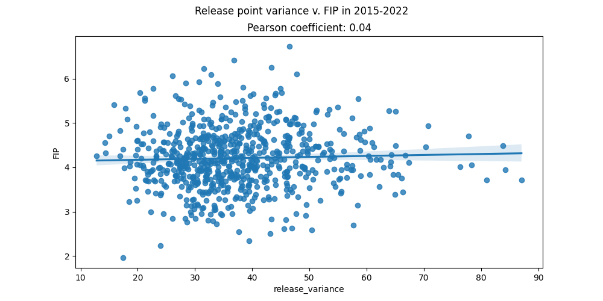
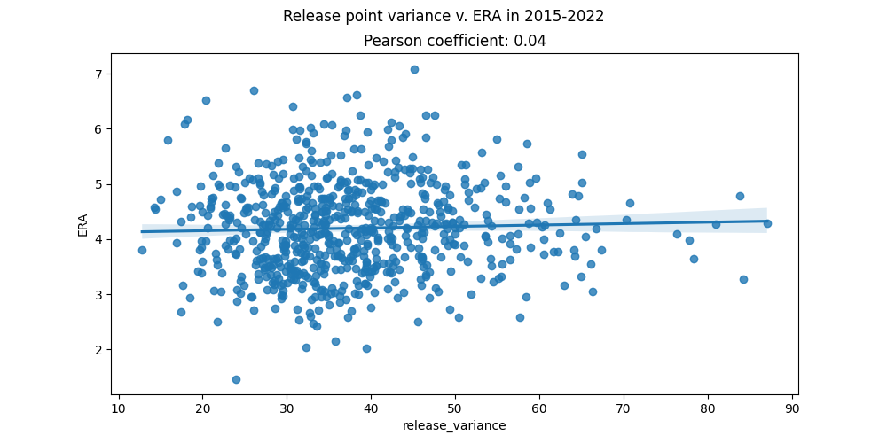
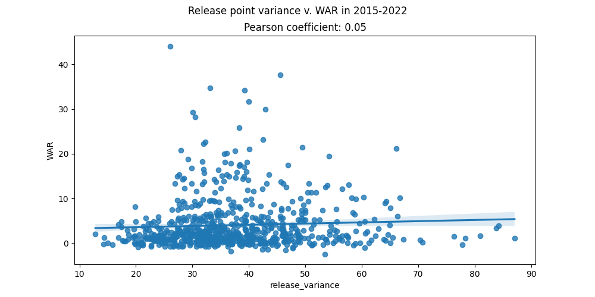
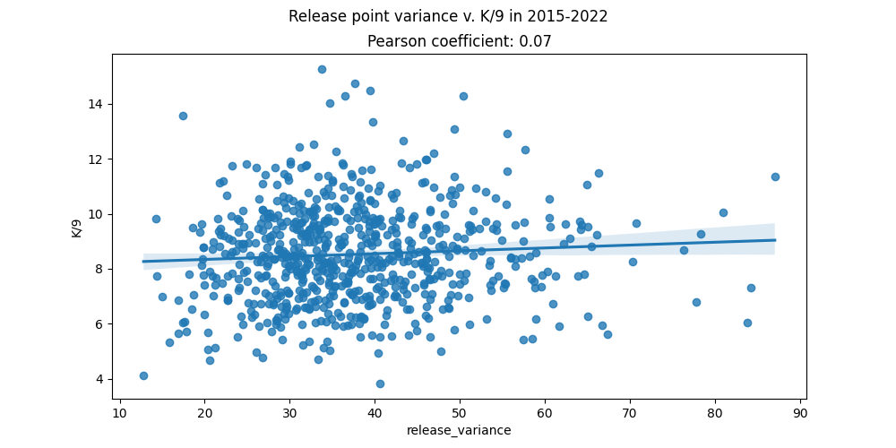

# Release Point Consistency
This code examines the release point of pitchers to determine which pitchers produce the most consistent release point with their pitchers and then seeks to conclude whether this is positively correlated with strong performance

## Motivation
It is a commonly held belief in baseball that your mechanics as a pitcher should not telegraph the location of your pitch or pitch type to the batter. Therefore, your release point should be consistent in order to delay the batter recognizing the pitch characteristics for as long as possible. While that makes sense on the surface, is that actually born out in reality? Does a consistent release point correlate to strong performance? I wanted to find that out for myself.

## Methodology
I relied on the pybaseball api to fetch statcast data from 2015-2022. This gave me access to X and Y coordinates for every pitch thrown by a pitcher during this time frame. From there, I calculated a pitcher's average release point, and then I determined each pitch's distance from that average release point within the 2-D space. Now that each pitch had a corresponding "distance" from the average release point for that pitcher, I averaged the distances together to determine just how consistent that pitcher was. A lower variance means the pitcher is more consistent. 

## Using the tool
### Installing the dependencies
```
pip3 install -r requirements.txt
```

### Running the program
```
python3 release_point_correlation.py --help
usage: release_point_correlation.py [-h] --test_seasons TEST_SEASONS --plate_appearances PLATE_APPEARANCES --stat {ERA,FIP,xERA,WAR,SO,K/9}

A utility that examines the release position of pitchers and seeks to predict high and low performers based off of consistency

options:
  -h, --help            show this help message and exit
  --test_seasons TEST_SEASONS
                        The future season(s) you want to use to examine a pitcher's release point data ex. 2021 or 2015-2022
  --plate_appearances PLATE_APPEARANCES
                        The minimum number of batters a pitcher needs to have faced to be considered
  --stat {ERA,FIP,WAR,SO,K/9}
                        The stat you want to compare release point variance to
```
```
python3 release_point_correlation.py --test_season 2015-2022 --plate_appearances 100  --stat FIP
```

## Results
Below you can find the results for comparing release point consistency to a pitcher's ERA, FIP, WAR, and K/9. To summarize, there is not a strong correlation between release point consistency and performance for any of the metrics.










Here we see release point variance compared to various metrics. In each one, the Pearson Correlation is extremely weak, implying release point consistency is not a strong indicator of good performance. 

## Summary

While it would have been nice to demonstrate that this was a valuable data point to zero in on, it is also valuable to know examining a pitcher's release point consistency is not critical when determining a pitcher's performance. Additionally, it can shape coaching and development strategies. A repeatable release point in and of itself does not seem to be a worthwhile pursuit. Therefore, it is more advantageous to pursue a pitcher's comfort and optimizing pitch flight characteristics as opposed to what happens as the ball is released. 
